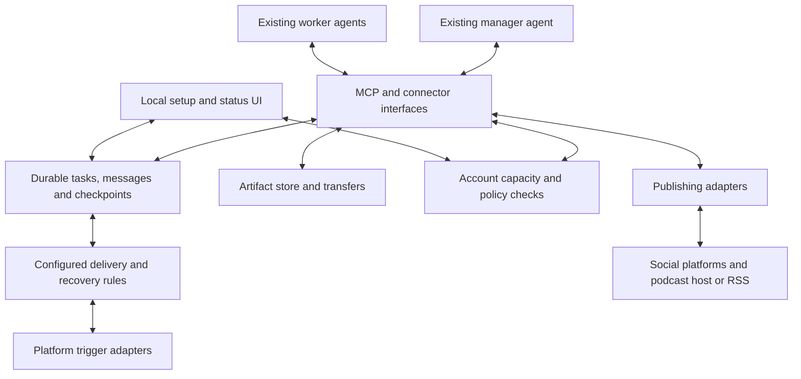

# Personal Agent and Publishing Bridge — Design v0.2

21 September 2026. Planning only; no integrations installed or tested. This design supersedes the existing-agent connection section and delivery estimates in connector-package-plan.md. That document remains the proposed publishing destination catalog, with all unverified routes retaining their qualifications.

## 1. Objective and boundary

Connect the user's existing Grok Bot, Muse, ChatGPT agents and Claude agents to one another and to publishing destinations. The user selects an existing agent as manager. Agents create content, select workers, review results, make editorial decisions and request publication. The bridge provides tool access, task delivery, artifact transport, account connections, quota information, durable records and deterministic recovery.

No embedded model, inference service or replacement agent runtime. No substitution of Grok Build, Muse Code, Codex or Claude Code for the named agent products. Supporting those separately later is optional. Existing subscription access is retained where the actual product permits it; no implicit migration to paid API inference.

Local computer and home-server installations are primary. The bridge itself can be free software. Existing provider subscriptions, API fees, storage and bandwidth remain separate costs.

## 2. Architecture

One async Rust service, one SQLite database and an artifact directory are sufficient for personal use. Expose Streamable HTTP MCP and an equivalent HTTP API; local stdio and CLI clients wrap the same core. Schemas and state transitions are independent of transports. React with strict TypeScript supplies the frontend, built into static assets served by Rust on the same origin. Docker Compose is the initial reproducible deployment, with a host launcher that opens the browser after readiness. See engineering-contract.md for binding engineering and launch requirements.

Cloud agents must reach an authenticated HTTPS endpoint. Home hosting therefore needs compatible secure ingress or a tunnel. Local storage does not imply that cloud agents or publishing services can reach localhost. No central paid relay is mandatory; any later relay is optional. Free hosting is a deployment option only after checking persistent storage, background execution, upload sizes, bandwidth and sleep behavior.

## 3. Connection model

Register an agent by actual product, account, agent identity, role and supported interface. Do not use provider name alone as its identity. Record its configured tools, supported settings, task delivery mode, artifact capabilities and account allowance pool.

Capabilities are independent flags: call bridge tools; retrieve assignments; receive external triggers; run scheduled checks; continue a session; cancel work; export artifacts; select model/effort; observe usage. Include evidence, account prerequisites, tested version and last verification date. A connected MCP client is not proof that every other flag is supported.

Use platform-specific plugin/connector packaging with a shared protocol. Setup instructions teach the existing agent how to claim assignments, report checkpoints and return results. They do not impose a content workflow or make the bridge select a manager.

### Current evidence and remaining proofs

| Actual product | Documented foundation | Still to prove in the integration |
|---|---|---|
| Grok Bot | MCP/plugin connections; persistent Bots; scheduled and supported event routines | Cross-provider assignment pickup, supported wake path, result export, quota observation and cancellation. Settings documentation says model selection is managed by Cursor, so do not promise an effort/model selector. |
| Claude agents | Remote MCP, plugins and scheduled tasks using connected tools | Exact supported account experience, unattended pickup cadence, recovery handoff, artifact export and usage observation. |
| ChatGPT agents | Workspace Agents document apps, model/effort settings, schedules and API triggers for eligible workspaces | Verify account eligibility, trigger authentication, result retrieval, connector permissions and quota reporting. Consumer agent mode is a separate capability test. |
| Muse | Custom connectors, persistent agent computer and background work; a connector vendor documents a Muse-to-MCP integration | Exact connector setup, assignment polling/wake behavior, artifacts, usage and permission persistence. Do not substitute Muse Code documentation. |

Sources: [Grok Bot routines](https://docs.x.ai/grok-bot/skills-routines-and-automations), [Grok Bot settings](https://docs.x.ai/grok-bot/settings-and-notifications), [Claude connectors](https://support.claude.com/en/articles/11175166-get-started-with-custom-connectors-using-remote-mcp), [Claude scheduled tasks](https://support.claude.com/en/articles/13854387-schedule-recurring-tasks-in-claude-cowork), [ChatGPT Workspace Agents](https://help.openai.com/en/articles/20001143), [Meta Muse architecture](https://research.meta.ai/blog/security-and-safety-for-ai-agents-our-approach-with-muse), [NetworkOS Muse integration](https://www.thenetworkos.com/help/networkos-in-muse).

## 4. Shared work protocol

The manager submits a bounded assignment with a target worker, objective, acceptance criteria, necessary context, input artifact references, requested output format and deadline. Optional execution preset and fallback policy refer only to supported settings and user-authorized alternatives.

Tools:

| Family | Functions |
|---|---|
| Discovery | `agents.list`, `agents.capabilities`, `accounts.capacity` |
| Work | `tasks.create`, `tasks.claim`, `tasks.get`, `tasks.list`, `tasks.checkpoint`, `tasks.complete`, `tasks.fail`, `tasks.cancel` |
| Coordination | `messages.send`, `messages.list`, `tasks.wait`, `manager.checkpoint` |
| Files | `artifacts.begin_upload`, `artifacts.commit`, `artifacts.get`, `artifacts.download` |
| Recovery | `tasks.reassign`, `tasks.resume`, `recovery.get_status` |
| Publishing | Existing capability, validation, upload, publication and readback tools from the destination catalog |

Large media travels through resumable upload/download endpoints, not base64 in prompts. Store size, media type, hash, ownership and producing task. Transfer only task-authorized context and files to the selected agent. Cross-provider private memory is not automatically copied; the portable handoff is explicit task context plus checkpoints.

Workers claim tasks atomically using expiring leases. Every attempt has a unique ID and fencing token. An expired worker cannot commit a result or start a bridge publication after reassignment. A lease expiring indicates lost contact, not proof of quota exhaustion. Preserve late outputs separately for the manager to inspect.

Task states: queued → leased → running → completed. Other explicit states include waiting_capacity, waiting_agent, waiting_user, interrupted, failed, cancel_requested and cancelled. Publication operations have their own processing and outcome_unknown states. Retries create attempts without replacing task history.

Cancellation revokes bridge permissions for the attempt immediately and asks the native agent to stop when supported. The bridge cannot guarantee that an unreachable native agent stops consuming usage or reverses external work already performed.

## 5. Delivery and waking agents

Prefer a documented native event or API trigger. Otherwise use the agent platform's configured recurring routine to check its inbox. Active agents may make bounded wait calls where their client supports them. Do not assume MCP notifications start an idle agent or that a long-held connection survives indefinitely.

Advertise delivery classes: event-triggered, scheduled with stated cadence, active-session-only or manual. Scheduled fallback is autonomous but has latency and usage overhead; it must not be presented as instant delegation. Avoid continual model-driven polling. An infrastructure heartbeat is not evidence of fresh provider capacity or agent reasoning activity.

A complete unattended release requires a tested wake route for both workers and the backup manager. Unsupported wake routes remain visible limitations, not hidden human steps.

## 6. Capacity and quota control

Track allowance pools, not only individual agents. One account may fund several agents or share credits with other products. Usage outside the bridge can change available capacity at any time.

Capacity records include pool ID; unit (tokens, credits, requests, percentage or unknown); used/remaining allowance; rolling/fixed window; reset time if reported; rate/concurrency limits; source; observed timestamp; confidence; and freshness deadline. Null means unavailable. Context-window size is a separate constraint, not remaining subscription quota.

Prefer documented machine-readable reporting. Where permitted and configured, use observable account UI readings or explicit agent/user reports as weaker evidence. Label estimates and stale readings. Error-derived exhaustion is evidence even when a numeric balance is unavailable. Never convert credits or percentages to tokens without a documented conversion.

Admission checks use the target account pool, pending commitments, a configurable manager reserve and the user's spending policy. Estimated commitments prevent the bridge itself from oversubscribing the same pool; they do not reserve capacity with the provider. Unknown capacity follows an explicit policy: allow limited work with recovery, or wait for a fresh reading. No false claim that an admitted job is guaranteed to finish.

Hard local controls: number of dispatched tasks, concurrency, deadlines, authorized destinations and bridge operations. Token/credit ceilings are hard only when the native platform supports enforcement; otherwise disclose them as monitored thresholds. The bridge cannot reliably prevent provider-side overage merely by observing stale usage. Setup must configure provider-side spending caps when the user requires a hard no-overage policy.

Known constraints: Grok Bot documents weekly and on-demand usage visibility, but that is not a verified reporting API; Muse documents usage limits without establishing a numeric connector endpoint. [Grok Bot settings](https://docs.x.ai/grok-bot/settings-and-notifications), [Muse](https://ai.meta.com/muse/).

## 7. Exhaustion and recovery

Worker exhaustion: retain task state and committed artifacts, mark its pool unavailable, stop new dispatches to that pool, and report to the manager. The manager can reassign, split remaining work or wait. If the manager is unavailable, only a pre-authorized fallback rule may reassign the same task unchanged. Otherwise pause it durably.

Manager exhaustion: use a periodically committed coordination checkpoint containing objective, outstanding tasks, decisions, accepted results and publication receipts. A deterministic controller can activate the user's named backup manager through its verified wake route. Transfer only the explicit checkpoint and authorized artifacts. Only one manager holds the current coordination lease; the former manager cannot issue new bridge writes after takeover. The backup agent makes subsequent decisions.

No surviving backup or wake route: preserve work, notify the user and wait for reset/reconnection. This is recoverable interruption, not continuous operation. Do not promise uninterrupted progress when all available accounts are exhausted.

An abrupt stop can lose unreported native-agent work. Recover only the last committed checkpoint and report missing progress. Never imply that hidden reasoning or unavailable native memory can be reconstructed. Before retrying any external write whose result is uncertain, reconcile it with the destination; if it cannot be resolved, surface outcome_unknown instead of risking duplicate publication.

## 8. Publishing and podcast scope

Retain the complete destination catalog in connector-package-plan.md: full episodes, RSS/audio directories, YouTube Shorts, TikTok, Instagram/Facebook Reels, Spotify Clips and appropriate native video/text/link formats on promotion/community platforms. X is native video and posts, not a Shorts product.

Agents supply destination-specific assets, captions, links and disclosures. The bridge validates technical requirements without rewriting or editing media. Podcast episode/clip relationships are explicit operations; a successful file upload does not establish successful publication or the correct association.

Store an operation ID, idempotency key, destination/account, artifact hash, supplied metadata, provider ID and last observed state. Native idempotency is used where available; otherwise reconcile remote state. Exactly-once external publication cannot be guaranteed by a local database alone.

Assign publishing permissions by agent and task. A worker need not receive publishing access to prepare content. All participating agents can publish when explicitly authorized; the manager role does not silently confer account-wide access. Native platform approvals remain applicable after bridge authorization.

## 9. User experience and data

Setup: connect agents → connect destinations → choose manager and backup → select supported presets → set quota/spend/fallback policies → verify a non-public end-to-end task.

The status UI shows: agents and actual capabilities; account pools with freshness/unknown labels; current tasks and attempts; blocked work and next reset; files; publication receipts; and actionable authentication/approval requests. It is a connection and operations UI, not another content creation workspace.

Core entities: accounts, allowance_pools, capacity_observations, agents, capabilities, tasks, task_attempts, messages, checkpoints, artifacts, publication_operations, credentials_references and audit_events. Use transactional state changes and a durable outbox for dispatch. Store secret references rather than plaintext credentials in task records. Keep native AI credentials in the native product wherever possible.

Scope access per user, agent, task and destination. Authenticate remote connectors; support provider-compatible OAuth or other supported credentials. Validate asset URLs and redirects against private-network access, use expiring download links, redact secrets and bound upload sizes. Include backup/restore for the database and artifacts, with secrets restored separately.

## 10. Reuse decision

Own the public contract and state machine. Use maintained protocol/HTTP/database libraries rather than inventing transports. Assess MCP Agent Mail and agent-mailbox-mcp for message storage and delivery primitives only. Neither is presently certified here for the target four products. Check licenses, maintenance, authorization, cancellation and crash behavior before copying or embedding code. A proof should compare the dependency cost with implementing the small required subset; do not adopt an entire coding-agent management product merely for its mailbox.

## 11. Implementation sequence and acceptance gates

1. **Integration proofs (rough estimate: 1–2 developer-weeks).** Verify exact-product connector calls, identity, artifacts, wake mechanism, usage observation and settings. Test the riskiest publishing routes from the catalog concurrently within the work plan. Record unavailable capabilities and stop unsupported promises early.
2. **Vertical slice (2–3 weeks).** One existing manager and a different-provider worker exchange a real task and artifact through the bridge. Add database persistence, leases, capacity pools and one complete publishing connector using an authorized private/test destination.
3. **Recovery and remaining agents (2–4 weeks).** Add other actual products, checkpoint transfers, exhausted-manager takeover, reconnect/cancel behavior and stale-capacity policies.
4. **Publishing breadth and packaging (4–8+ weeks).** Complete destination-specific operations, installer/Compose distribution, upgrades, backup and compatibility reports. External approvals and browser-dependent routes can extend or block coverage.

Estimates are planning ranges for one experienced developer with coding assistance, not commitments. No release date for complete coverage until access proofs pass.

Release tests must demonstrate: actual cross-provider agents rather than model API substitutes; unattended task pickup with measured latency; artifacts surviving restart; shared quota exhaustion; unknown/stale readings; worker and manager failure mid-task; one authoritative manager after recovery; expired leases fencing old attempts; cancellation without false completion; no silent paid fallback; no duplicate publication after lost responses; and partial publication accurately reported per destination.

Failure injection can test the bridge without deliberately exhausting subscriptions. Live checks still need to validate how each native product exposes real limits and interruptions. Publish an operation-by-operation compatibility report, with verified, conditional, experimental and unsupported labels.

## 12. First concrete deliverable

A versioned capability matrix and executable contract prototype using two actual agent platforms. Acceptance: the manager assigns work, the worker returns a file, a simulated quota interruption is recovered according to configured policy, and an authorized publishing tool returns a verified receipt. This proves the design before broad UI or connector development.
